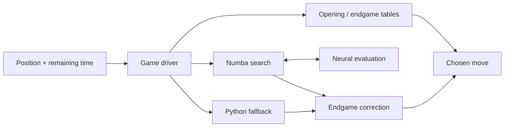

# Cory — AI Chessathon quarter-finalist

**7th of 400 on the qualifier ladder · London quarter-finalist · Team catfish**

Cory is a Python chess engine with a neural evaluation network trained from scratch. It competed in the
[AI Chessathon](https://aichessathon.com) London final on **12 September 2026**, under a single-core CPU
limit, a 30-second startup budget, and a 50 MB submission cap.

The project combines search algorithms, neural-network training, runtime optimization, and experimental
evaluation. Over one week, development included a **574-million-position training set** and roughly
**66,000 benchmark games** to decide which changes improved play.

[Engineering decisions](#three-engineering-decisions) · [Try it](#try-it) ·
[Architecture](#architecture) · [Results](#results-and-measurement)

## What this project contains

- **A chess engine:** board representation, search, neural evaluation, and a driver that manages the clock
  and startup compilation.
- **A training pipeline:** position encoding, data generation and mixing, PyTorch training, and export to
  compact integer weights for CPU inference.
- **An evaluation framework:** paired games, statistical comparisons, speed and tactics benchmarks, and
  tests for legality, protocol handling, time limits, and endgames.

The competition runner and starter opponents are organiser-provided code. Cory's network was trained
within the project; Stockfish supplied training labels and reference opponents. The repository includes
the final engine, eight milestone snapshots, training and benchmark code, and recorded competition games.

## Three engineering decisions

### 1. Treat startup time as part of performance

Numba made Python search fast enough to compete, but compilation could take about **50 seconds**—longer
than the final's entire startup allowance. Compilation work brought a milestone build down to about
**18 seconds**. The final build compiled in roughly **22–27 seconds on the competition platform**.

The driver starts compilation in a background thread, signals readiness before the deadline, and uses
opening-table moves or a Python fallback while compilation finishes. This made startup reliability an
explicit part of the engine design, alongside search speed.

Explore: [runtime driver](engine/agent.py), [fallback engine](engine/pyengine.py),
[v12.27 snapshot](versions/v12.27-fastcompile/).

### 2. Choose training data by playing strength

The final network learned from **574 million positions**, combining human-game positions from the Lichess
evaluation database, relabelled engine games, and Stockfish self-play. Training ran on a single A30 GPU;
the exported network occupies approximately **7.1 MB** and uses integer arithmetic for inference.

Adding more self-play data did not reliably make the engine stronger. A mix near **one human position per
self-play position** worked better than pushing volume further. Likewise, wider and more complex networks
were rejected when better training metrics failed to translate into stronger play.

Explore: [training recipe](training/README.md), [trainer](training/train.py),
[data mixing](training/mix_sets.py), [CPU evaluation](engine/nnue_eval.py).

### 3. Measure the outcome that matters

Candidates were screened with inexpensive checks before spending hundreds of games at the competition's
**120-second + 0.5-second-per-move** clock. Games used paired openings with colours reversed, statistical
comparisons, and external reference opponents. Roughly **66,000 games** ran as single-core jobs on a
university HTCondor pool during the week.

Eighteen additional approaches measured at or below zero, including variants that searched deeper or
evaluated positions faster. These experiments pointed toward evaluation quality as the late-stage
constraint: a faster or deeper search was not sufficient evidence to ship a change.

Explore: [game runner](bench/gauntlet.py), [paired-game statistics](bench/stats.py),
[result aggregation](bench/aggregate.py), [contract and regression tests](tests/).

## Try it

With `uv` and `make` installed, run these from the repository root. Setup uses the competition's pinned
dependencies and requires Python 3.12 or newer. The first engine run includes Numba compilation, which
can take tens of seconds depending on the machine.

```sh
make setup                          # Install dependencies
make speed                          # Analyse eight positions; print moves, depth, and speed
make play                           # Play against the supplied minimax baseline
make test                           # Run engine, protocol, endgame, and statistics tests
```

`make play` runs a bot-versus-bot game in the terminal. To compare with an earlier build:

```sh
make play OPP=versions/v12.27-fastcompile
```

The engine implements the competition interface, `get_move(fen, time_left_ms) -> uci`.
Each game has its own process, which the platform suspends while the opponent thinks.
`make zip` packages `engine/` into `submission.zip`, with `agent.py` at the archive root.

## Architecture

The driver checks the opening table and supported endgames before searching. Search uses the compiled
engine when it is ready, and the Python fallback otherwise; endgame tables can also correct a search move.



| Component | Implementation |
|---|---|
| [Search](engine/nativesearch.py) | Alpha-beta search with principal-variation search, move ordering, pruning, and a 16-million-entry transposition table. About 625,000 nodes/second on the platform core. |
| [Board](engine/fastboard.py) | Bitboards and sliding-piece attacks designed for Numba compilation. |
| [Evaluation](engine/nnue_eval.py) | Efficiently updatable neural network (NNUE): piece-square inputs, 8 mirrored king buckets, 768 hidden units, and 8 output buckets by piece count. |
| [Opening table](engine/weights/book.json) | 92,638 positions generated with Stockfish; table moves save search time in the opening. |
| [Endgame probing](engine/tablebase.py) | Approximately 33 MB of Syzygy data for selected 3–5-piece endings, providing exact outcomes for supported positions. |

The submission contains Python source and data files; native machine code is generated at startup.

## Results and measurement

**Qualifier:** 7th of 400. **London final:** 8 wins, 3 draws, and 2 losses in the 13-round Swiss, followed by
knockout wins over zak and Opus Carlsen, then a 1–3 quarter-final loss to omega3 fish.

The final build's estimated strength was approximately **3000 ± 50 on the project's benchmark scale**,
anchored to reference engines and Stockfish's fixed-Elo settings. This is a calibration estimate under
the tested conditions, rather than an official human or competition rating.

Real-clock comparisons typically used 400 games, with sequential testing at −5/+15 Elo bounds. Gains
against earlier Cory builds did not transfer fully to external opponents, so both comparisons informed
decisions. The table below preserves selected development measurements; raw cluster benchmark outputs
and site-specific HTCondor/Slurm job files are not included.

<details>
<summary>Eight milestone builds and measured improvements</summary>

Self-play figures are changes against the comparison build, not cumulative gains. Runs used 400 games
unless noted; final-build entries include separate component experiments.

| Build | Main change | Self-play Elo change | Estimated anchored Elo |
|---|---|---|---|
| [v6](versions/v6-native/) | First Numba search | +360 ± 66 | ≈ 2250 |
| [v12](versions/v12/) | First trained NNUE replaces handwritten evaluation | +94 ± 46 | ≈ 2495 |
| [v12.8](versions/v12.8-lichessmix/) | Lichess positions with Stockfish labels | +174 ± 26 | ≈ 2720 |
| [v12.13](versions/v12.13-merge/) | History heuristics, faster evaluation, startup fix | +25 ± 14 (800 games) | ≈ 2850 |
| [v12.21](versions/v12.21-alldata/) | Search pruning and a 454-million-position network | +42 ± 21 | ≈ 2940 |
| [v12.27](versions/v12.27-fastcompile/) | Balanced data mix, mate conversion, faster compilation | +25 ± 19 | ≈ 2990 |
| [v12.29](versions/v12.29-final/) | Opening table and Syzygy probing | +19 ± 20; +16 ± 20 | ≈ 3000 |
| [v12.31](versions/v12.31-table2/) | Expanded opening table and larger transposition table | +10 ± 18 (transposition table) | ≈ 3000 |

</details>

## Repository guide

| Directory | Contents |
|---|---|
| [`engine/`](engine/) | Final submission source, trained weights, opening and endgame tables |
| [`training/`](training/) | Data preparation, neural-network trainers, export and evaluation tools; large training datasets are excluded |
| [`bench/`](bench/) | Match running, statistical analysis, speed, tactics, and opening-table generation |
| [`tests/`](tests/) | Engine behaviour, protocol, clock, endgame, and statistical checks |
| [`versions/`](versions/) | Eight historical engine snapshots for comparison |
| [`reference/`](reference/) | Competition rules, recorded games in PGN format, and agent logs |
| [`opponents/`](opponents/) | Wrappers for reference engines; binaries are built locally |
| [`harness/`](harness/), [`baselines/`](baselines/) | Organisers' runner, referee, and starter bots |

## Licence and acknowledgements

Project code is available under the [MIT licence](LICENSE). The organisers' starter code retains its
[original MIT notice](harness/LICENSE-starter.txt). Cory uses python-chess and Numba, was trained with
PyTorch, and uses Lichess evaluation data, Stockfish-generated labels and opening moves, and Syzygy
endgame tables.
